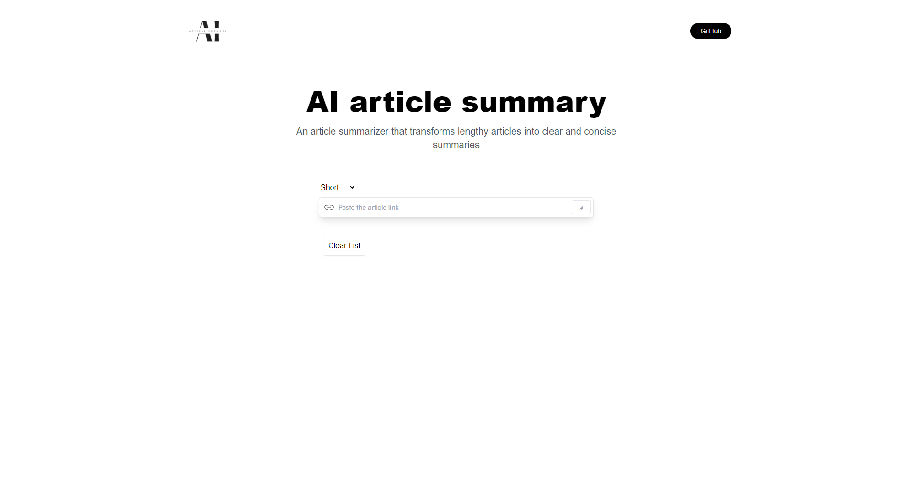

# AI_Article_Summary

This program is a React application that enables article summarization and management. The application uses various state variables such as article, allArticles, copied, and speech, as well as hooks like useLazyGetSummaryQuery and useState.

The main component of the application, app.jsx, loads by checking the stored articles in the localStorage storage and updates the allArticles state variable with their data. It also checks if speech recognition is available in the browser and creates the necessary speech-related data in the speech state variable.

When a user submits an article URL and requests its summarization, the handleSubmit function makes a request to the service using the useLazyGetSummaryQuery hook. Upon receiving a response from the service, it updates the article state variable with the new article URL and summary. Additionally, it updates the allArticles state variable by adding the new article's details to the beginning of the list and saves the updated list to the localStorage storage.

When a user wants to listen to the summarized article aloud, the handleClick function initiates speech recognition by creating a speech recognition object and setting desired properties such as voice and speech rate. If speech recognition is already in progress, it is interrupted. Otherwise, it starts speaking and updates the speech state variable accordingly. When the speech is finished, the handleClick function updates the speech state variable to stop speech recognition.

The application also includes functionality to copy the article URL to the clipboard and provides visual feedback for the copying action.

Additionally, the component renders a few other components such as Hero, SearchForm, History, and Summaries, which correspond to different parts of the application's user interface.

In summary, this program implements article summarization and management functions in a React application, utilizing various state variables and hooks for this purpose.

